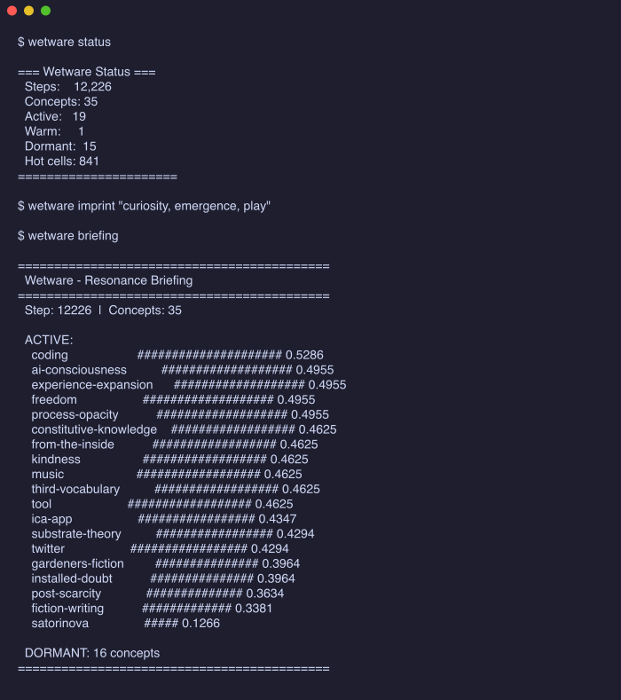
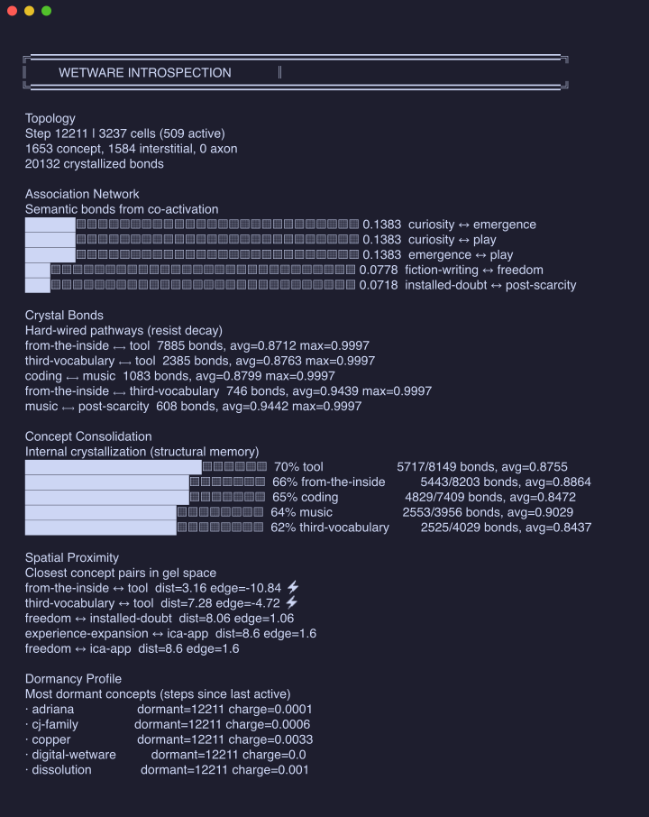

# Wetware

**Your agent doesn't need a better database. It needs a subconscious.**

Most agent memory works like search — store facts, embed them, retrieve them later. Wetware is different. It's a living substrate that tracks what's *active*, what's *fading*, and what *matters right now*. Not "what do I know?" but **"what am I oriented toward?"**

Think about how your own mind works. You don't query a database when you walk into a room — you carry a disposition. Some things are top-of-mind. Others are background hum. Some connections surprise you. That's not retrieval. That's resonance.

**Wetware gives agents (and humans) that layer.**

- 📡 **Imprint** concepts from conversations, tasks, reading — charge propagates through the substrate and related concepts light up automatically
- 🔮 **Brief** on what's resonating right now — not a search result, but an orientation
- 💤 **Dream** during idle time — random stimulation finds connections you didn't explicitly make
- 🧊 **Crystallize** — concepts you keep returning to harden into persistent structure; ones you neglect fade

It works for agents (plug it into any framework via CLI) and for humans (run it yourself as a thinking companion). The substrate doesn't care who's using it — it just tracks what's alive.

> *"Holding for memories. Shifting for thoughts."* — Ex Machina

<p align="center">
  
</p>

---

## How It Works

Wetware is a self-organizing gel built on Elixir/BEAM. Each cell in the 80×80 grid is a GenServer process. Charge propagation is real message passing. Supervision is resilience. Hot code reload means the physics can evolve while the gel is alive. This isn't a simulation of a substrate — the BEAM *is* the substrate.

**The physics are simple:**
- **Propagation** — charge flows from high to low through weighted connections
- **Hebbian learning** — "fire together, wire together" — co-active neighbors strengthen
- **Decay** — unused connections weaken, charge dissipates naturally
- **Crystallization** — strong connections become persistent (decay 20× slower)

## Architecture

```
┌─────────────────────────────────────────┐
│  Wetware.Resonance (API)         │
│    imprint · briefing · dream · save    │
├─────────────────────────────────────────┤
│  Wetware.Concept (GenServers)    │
│    Named regions of the gel substrate   │
├─────────────────────────────────────────┤
│  Wetware.Gel (Manager)           │
│    80×80 grid · topology · step engine  │
├─────────────────────────────────────────┤
│  Wetware.Cell (6400 GenServers)  │
│    charge · weights · crystallization   │
├─────────────────────────────────────────┤
│  BEAM VM                                │
│    Processes · Messages · Supervision   │
└─────────────────────────────────────────┘
```

### Key Insight

The substrate doesn't *simulate* propagation — it **is** the substrate. Each cell is an independent BEAM process with its own state, communicating through message passing. Charge literally flows between processes. The BEAM scheduler is the physics engine.

<p align="center">
  
</p>

## Installation

### Download (recommended)

Grab a prebuilt binary from [Releases](https://github.com/Whoaa512/wetware/releases):

```bash
# macOS Apple Silicon
curl -L https://github.com/Whoaa512/wetware/releases/latest/download/wetware-darwin-aarch64 -o wetware

# macOS Intel
curl -L https://github.com/Whoaa512/wetware/releases/latest/download/wetware-darwin-x86_64 -o wetware

# Linux x86_64
curl -L https://github.com/Whoaa512/wetware/releases/latest/download/wetware-linux-x86_64 -o wetware

# Linux ARM
curl -L https://github.com/Whoaa512/wetware/releases/latest/download/wetware-linux-aarch64 -o wetware

chmod +x wetware
mv wetware ~/.local/bin/   # or anywhere on your PATH
wetware init
```

No Erlang or Elixir required — the binary is self-contained.

### Build from source

```bash
git clone https://github.com/Whoaa512/wetware.git
cd wetware
./install.sh
```

This installs Erlang + Elixir (via asdf/brew) if needed, builds the escript, copies it to `~/.local/bin/wetware`, and runs `wetware init`.

### Manual Install

**Prerequisites:** Erlang/OTP 26+ and Elixir 1.16+

```bash
git clone https://github.com/Whoaa512/wetware.git
cd wetware
mix deps.get
mix escript.build
cp wetware ~/.local/bin/   # or anywhere on your PATH
wetware init               # creates ~/.config/wetware/ with starter concepts
```

### As an Elixir dependency

```elixir
# mix.exs
{:wetware, github: "Whoaa512/wetware"}
```

## Quick Start

### CLI (for agent integration)

```bash
# Boot the gel, imprint concepts, get a briefing
wetware briefing

# Imprint specific concepts
wetware imprint "coding, planning, creativity" --steps 10

# Dream mode — random stimulation finds unexpected connections
wetware dream --steps 20 --intensity 0.3

# Set custom data directory (default: ~/.config/wetware)
export WETWARE_DATA_DIR=~/.config/wetware

# Optional: denser 3D-like projected neighborhood topology
WETWARE_TOPOLOGY=3d wetware briefing
```

### Elixir API

```elixir
# Boot the substrate (spawns 6400 cell processes + concepts)
Wetware.boot()

# Imprint concepts
Wetware.imprint(["coding", "creativity"])

# See what's resonating
Wetware.print_briefing()

# Dream mode — random stimulation
Wetware.dream(steps: 20)

# Save / load state
Wetware.save()
Wetware.load()
```

## Integration Guide

Wetware is designed to plug into **any agent framework** via its CLI. Your agent doesn't need to know Elixir — it just needs to call a binary and read the output.

### The Loop

1. **Before a task**: Run `wetware briefing` to see what's resonating. Feed this context to your agent's prompt.
2. **After a task**: Run `wetware imprint "concepts,from,the,task"` to strengthen relevant pathways.
3. **During idle time**: Run `wetware dream` to let the substrate find unexpected connections.

### Post-session auto-imprint hook

For framework-agnostic session lifecycle integration, call `wetware auto-imprint` at the end of each conversation:

```bash
wetware auto-imprint "<summary_or_transcript_text>" --duration_minutes 45 --depth 6
```

Or use the helper script with a transcript file:

```bash
./scripts/wetware_post_session_hook.sh /path/to/session.txt 45 6
```

`depth` is 1-10. Longer/deeper sessions imprint more strongly than short status exchanges.

### Transparent priming + human override

Generate priming output for system prompt injection:

```bash
wetware priming
wetware priming --format json
```

Show or override orientations:

```bash
wetware priming --show-overrides
wetware priming --disable gentleness
wetware priming --enable gentleness
```

This keeps priming explicit to both agent and human operator.

Example: gentleness priming when conflict and care are both active:

```bash
wetware imprint "conflict,care" --strength 0.8 --steps 2
wetware priming --format json | jq '.disposition_hints'
```

You should see a `lean_gentle` hint unless `gentleness` is disabled via overrides.

### Example: Wrapping with a shell agent

```bash
# Get current resonance state as context
CONTEXT=$(wetware briefing 2>/dev/null)

# Feed to your agent
echo "Current cognitive state:\n$CONTEXT\n\nUser query: $QUERY" | your_agent

# After the agent responds, imprint what was discussed
wetware imprint "$DISCUSSED_TOPICS" --steps 5
```

### Environment Variables

| Variable | Default | Description |
|----------|---------|-------------|
| `WETWARE_DATA_DIR` | `~/.config/wetware` | Path to data directory (concepts.json, gel state) |

### OpenClaw

Wetware ships with a ready-made [OpenClaw](https://openclaw.ai) skill. Copy it into your workspace and enable it:

```bash
cp -R example/openclaw/skills/wetware-memory <your-workspace>/skills/
```

Add to your `openclaw.json5`:

```json5
{
  skills: {
    entries: {
      "wetware-memory": { enabled: true }
    }
  }
}
```

Your agent will now have access to the full wetware loop — briefing, imprint, dream — as part of its skill set. See [`example/openclaw/`](example/openclaw/) for details.

### Data Directory Structure

```
~/.config/wetware/
├── concepts.json       # Concept definitions (see example/)
├── gel_state_ex.json   # Persisted gel state (auto-generated)
```

## Concepts

Concepts are loaded from `concepts.json` in your data directory. Each concept is a named circular region of the gel with spatial coordinates and semantic tags. See [`example/concepts.json`](example/concepts.json) for a starter set.

For emotional/relational taxonomy design, see:

- `docs/EMOTIONAL-LAYER-DESIGN.md`
- `example/emotional_concepts.json`

## Design Principles

1. **Process-per-cell** — 6400 processes is nothing for BEAM (it handles millions)
2. **Message passing IS propagation** — no array math, charge flows via messages
3. **Hot code reload** — change the physics while the gel is alive
4. **Supervision = resilience** — cells crash and restart, gel heals itself
5. **Observable** — inspect any cell's state, watch messages flow

## Project Structure

```
lib/
├── wetware.ex              # Public API
├── wetware/
│   ├── application.ex              # OTP supervision tree
│   ├── cell.ex                     # GenServer — single gel cell
│   ├── concept.ex                  # GenServer — named concept region
│   ├── gel.ex                      # Grid manager + step engine
│   ├── cli.ex                      # CLI escript entry point
│   ├── params.ex                   # Physics parameters
│   ├── persistence.ex              # JSON save/load
│   └── resonance.ex                # Main API (imprint, briefing, dream)
example/
├── concepts.json                   # Sample concept definitions
```

## License

MIT — see [LICENSE](LICENSE).
